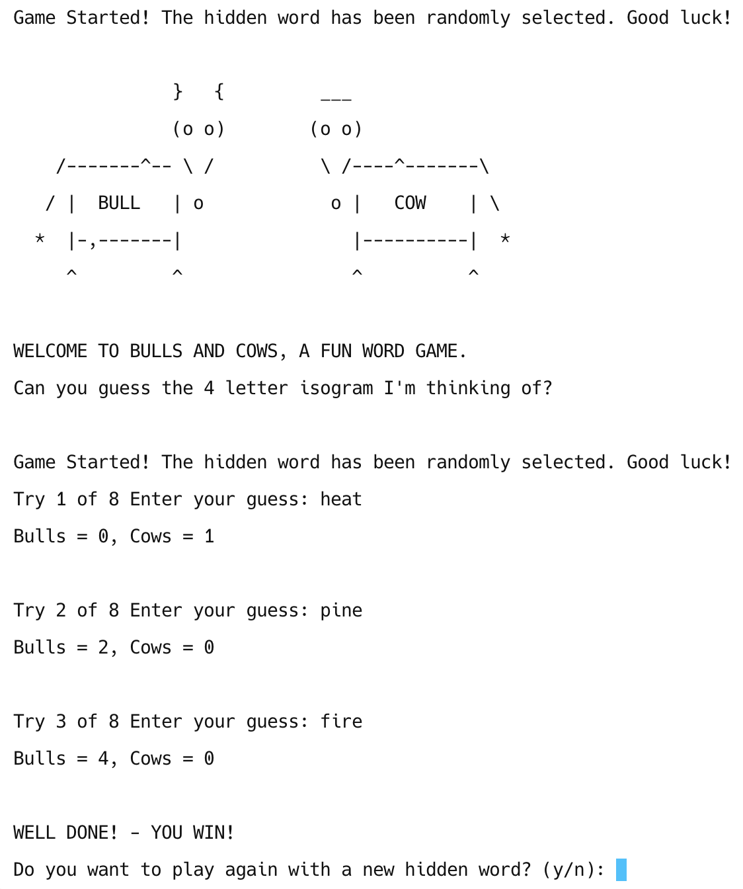

# Bulls and Cows

Welcome to **Bulls and Cows**, a fun and interactive word-guessing game built in C++! Test your logical thinking and vocabulary skills as you try to guess the hidden isogram (a word with no repeating letters).

---

## How to Play?

1. **Objective**: The game generates a random hidden isogram (4-letter word). Your task is to guess the word within a limited number of tries.
2. **Rules**:
    - Each guess should be a valid isogram (no repeating letters).
    - The guess must be the same length as the hidden word.
    - Only lowercase letters are allowed.
3. **Feedback**:
    - **Bulls**: Correct letters in the correct position.
    - **Cows**: Correct letters but in the wrong position.

---

## Features

- **Random Word Selection**: The game chooses a random 4-letter word from a predefined list at the start of each game.
- **Dynamic Difficulty**: The maximum number of tries is determined based on the word length.
- **Input Validation**: Ensures that guesses are valid isograms, lowercase, and of the correct length.
- **Game Summary**: Displays a win/loss message at the end of the game.
- **Replay Option**: Play as many times as you'd like with a new hidden word each time.

---

## Screenshots

